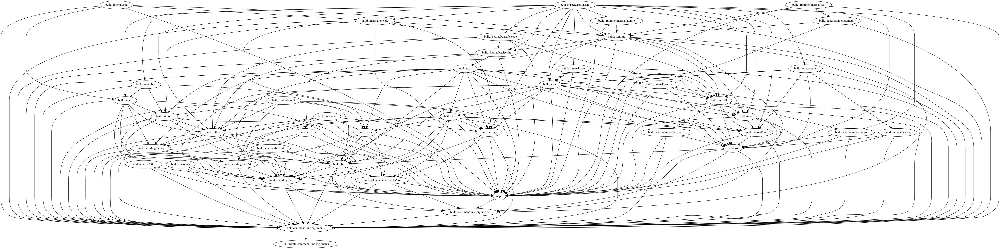

# go-actiongraph2dot

Transfer actiongraph.json to dot to visualize Action graph.

## What is Action Graph ?

```shell
$ go build -debug-actiongraph=graph.json

$ head graph.json
[
        {
                "ID": 0,
                "Mode": "link-install",
                "Package": "command-line-arguments",
                "Deps": [
                        1
                ],
                "Objdir": "/var/folders/y3/t2g2qt4s6sxbptdqcf9t_s9r0000gn/T/go-build716887516/b001/",
                "Target": "main",
```

## How to use

### Install

```shell
$ go get github.com/sachaos/go-actiongraph2dot
```

### Visualize action graph

```shell
$ go build -debug-actiongraph=graph.json . && cat graph.json | go-actiongraph2dot | dot -Tpng > graph.png && open graph.png
```


